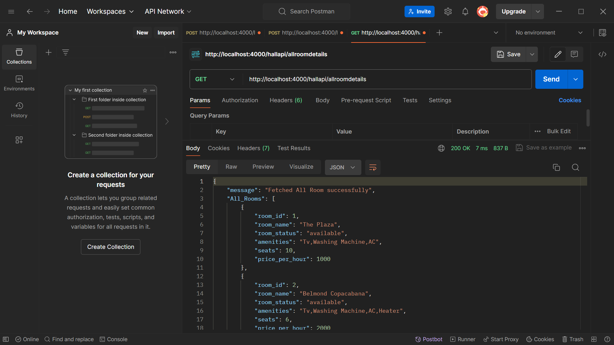

# GET /hallapi/allroomdetails
## Description: Retrieves details of all available rooms

# POST /hallapi/createroom
## Description: Creates a new room

# POST /hallapi/bookingroom
## Description: Books a room for a customer.

# GET /hallapi/bookedroomdata
## Description: Retrieves data of all booked rooms.

# GET /hallapi/customersbookeddata
## Description: Retrieves data of all customers with booked room details.

# GET /hallapi/customerbookingcount
## Description: Retrieves booking details for each customer along with booking count.

